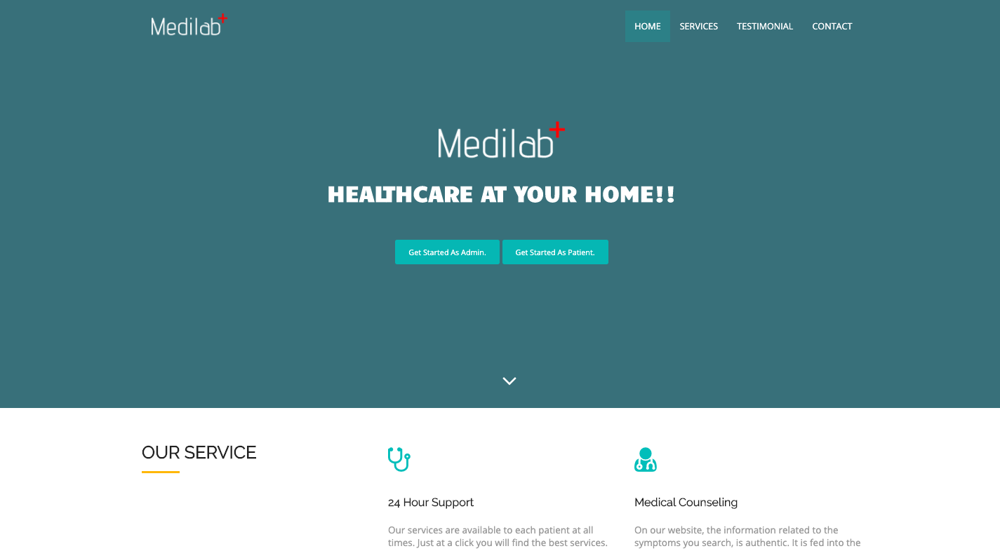
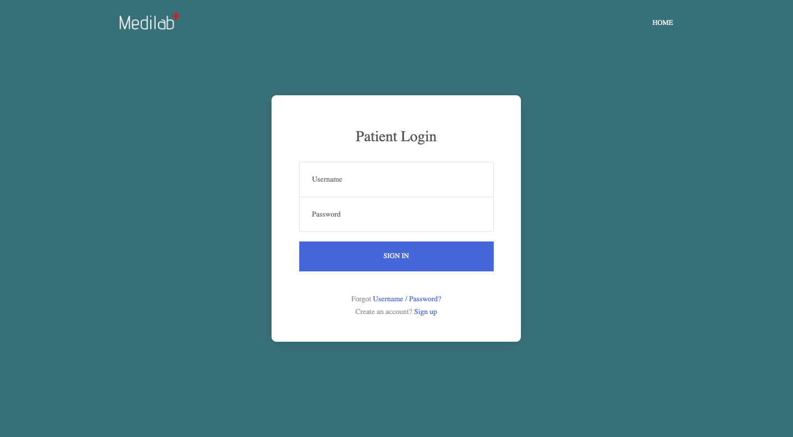
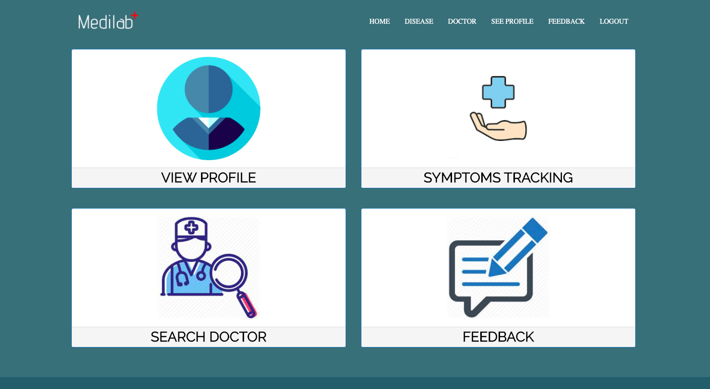
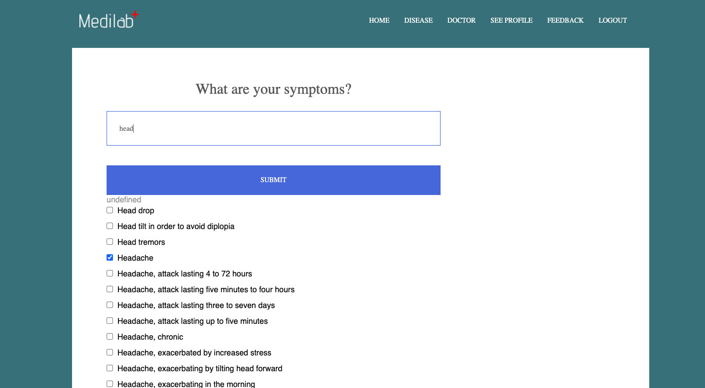
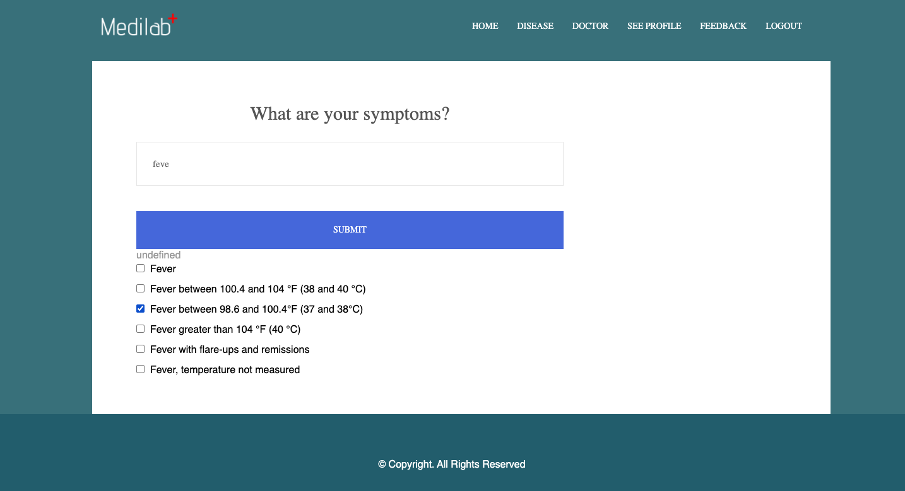
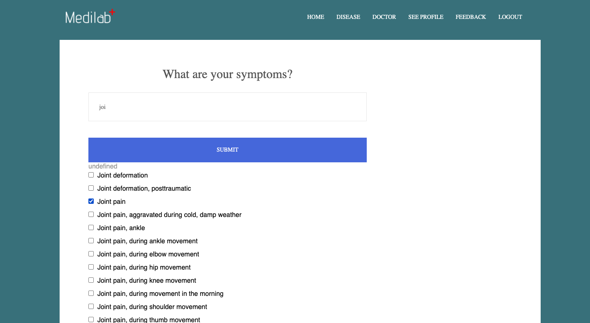
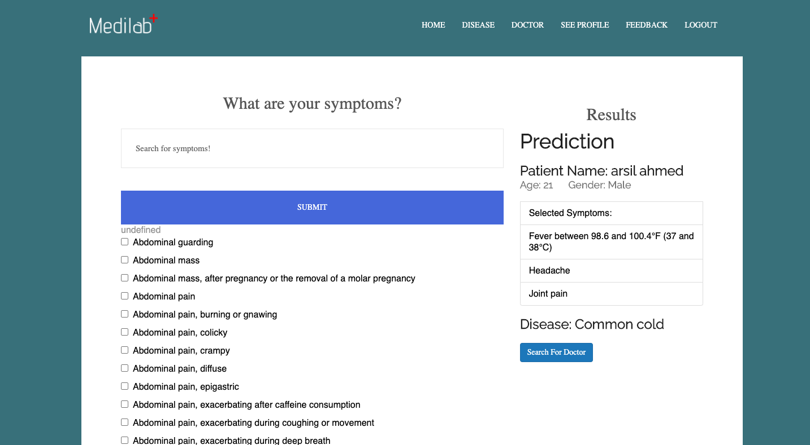
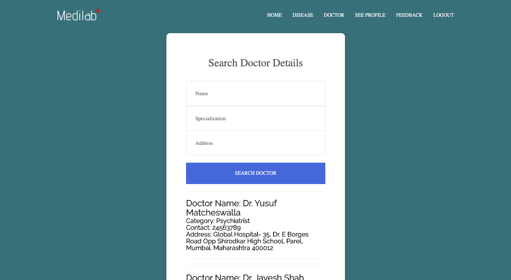
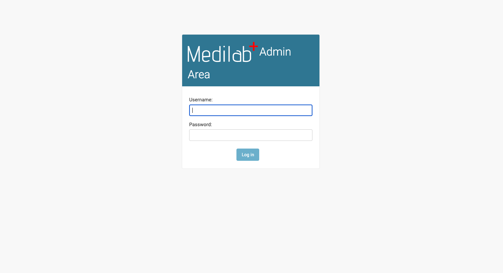
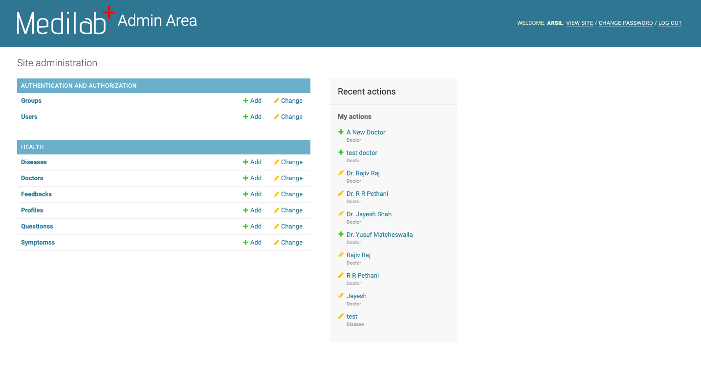

# Medilab

A Django based Disease Prediction System. Provides type of disease based on selected symptoms.

## Getting Started

These instructions will get you a copy of the project up and running on your local machine for development and testing purposes.

### Prerequisites

Clone the repository and open in any code editior, open the terminal and create a fresh virtual environment by typing following command. Then activate it by the next command.

#### On Windows
```python
py -m venv env

.\env\Scripts\activate
```
#### On Mac
```python
python3 -m venv env

cd env

source env/bin/activate
```

### Installing

After successfully activating virtual environment
type the following command to install all requirements for starting the project.

```python
pip install -r requirements.txt
```

At this stage you have successfully done with the installation of project, it is ready to run now with one step remaining i.e., creating database go into `Hcare/settings.py` and check the database name and create the same database in you PostgreSQL application (don't forget to change the password) as mentioned in below code snippet.

```python
DATABASES = {
	'default': {
		'ENGINE': 'django.db.backends.postgresql',
		'NAME': 'hcare',    <- create database of same name
		'USER': '',     <- Your posgresql username
		'PASSWORD': '',     <- Your password
		'HOST': 'localhost',
	}
}
```
After configuring your database settings finally run below two commands for making tables required to run the project.

```python
python manage.py makemigrations

python manage.py migrate
```
This will successfully create tables in the database and you can check those tables in you database.
 To run the project type:
 ```python
python manage.py runserver

# then visit below url in your browser:
http://127.0.0.1:8000/
```
And guess what you have successfully configured this system to run on you machine.

## Configuring API
Now we have to make a small change in the code base to make our API calls working.
Visit [Infermedica](https://infermedica.com/product/infermedica-api) and request account to get your APP_ID and APP_KEY.
Then open `health/views.py` and in line `145` paste your APP_ID and APP_KEY as below.

```python
api = infermedica_api.configure(app_id='YOUR_APP_ID', app_key='YOU_APP_KEY')
```
This will allow you to run the application perfectly in you machine!

## Screenshots of Pages

### Home:
Below is the home page where users or admins can login.



### Patient Login:
If patients have accounts they can login or create account.



### Patient Dashboard:
Patients can:
* View Profile: See their profile details (required to fill after creating account in the system.)
* Symptoms Tracking: Getting symptoms page having list of various symptoms.
* Search Doctor: Search for doctor.
* Feedback: Provide feedback.



### Symptoms:
Symptoms page where symptoms can be selected by typing in the live search.







### Results:
Result is predicted(fetched) by making api call to the Infermedica's API.



### Doctor:
Doctor Page can search for doctor based on various filters.



### Admin Login:
Customized Built-in Django's Admin panel.



### Admin Dashboard:
Admin Dashboard having all tables and can add new doctor into the system.



## Resources:

For getting APP_ID and APP_KEY: [Infermedica](https://infermedica.com/product/infermedica-api)

For more configuration in the API results visit [Infermedica's Github Page](https://github.com/infermedica/python-api)

